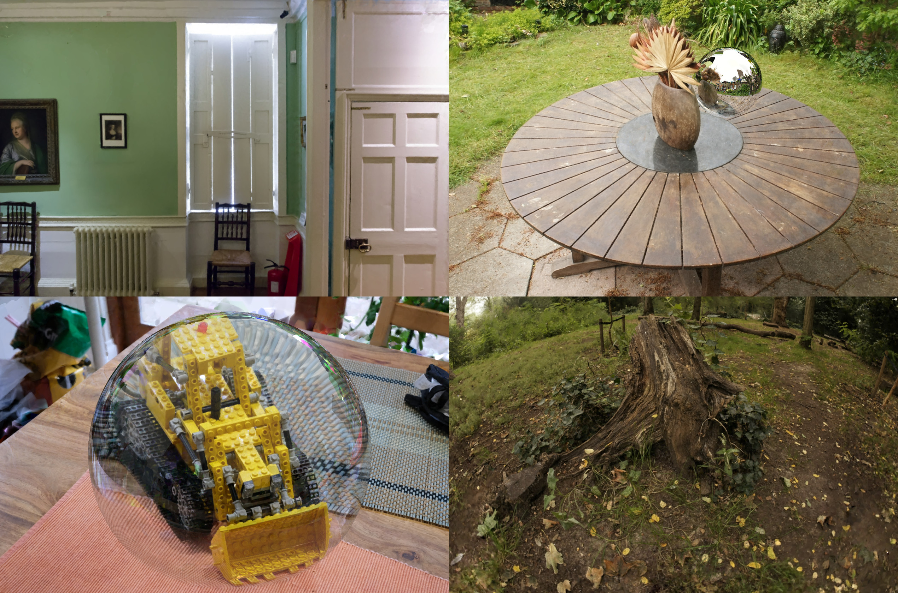

# Radiant Foam: Real-Time Differentiable Ray Tracing

## Shrisudhan Govindarajan, Daniel Rebain, Kwang Moo Yi, Andrea Tagliasacchi

This repository contains the official implementation of [Radiant Foam: Real-Time Differentiable Ray Tracing](https://radfoam.github.io).

The code includes scripts for training and evaluation, as well as a real-time viewer that can be used to visualize trained models, or optionally to observe the progression of models as they train. Everything in this repository is non-final and subject to change as the project is still being actively developed. **We encourage anyone citing our results to do as RadFoam (vx), where x is the version specified for those metrics in the paper or tagged to a commit on GitHub.** This should hopefully reduce confusion.

Warning: this is an organic, free-range research codebase, and should be treated with the appropriate care when integrating it into any other software.

## Known issues
 - GPU memory usage can be high for scenes with many points. You may need to reduce the `final_points` setting to train outdoor scenes on a 24GB GPU. This will hopefully be improved the future.
 - Best PSNR is acheived with the default softplus density activation, but also it causes an increase in volumetric artifacts. Using exponential activation may result in qualitatively better renders. We are planning to add configuration options for this.
 - The Delaunay triangulation is not perfectly robust, and relies on random perturbation of points and iterative retries to attempt to recover from failures. Training may stall for long periods when this occurs.

## Getting started

Start by cloning the repository and submodules:

    git clone --recursive https://github.com/theialab/radfoam

You will need a Linux environment with Python 3.10 or newer, as well as version 12.x of the [CUDA Toolkit](https://developer.nvidia.com/cuda-downloads). Please ensure that your installation method for CUDA places `nvcc` in your `PATH`. The following instructions were tested with Ubuntu 24.04.

After installing the CUDA Toolkit and initializing your python virtual environment, install PyTorch 2.3 or newer. For example, with CUDA 12.1:

    pip install torch==2.3.0 torchvision==0.18.0 torchaudio==2.3.0 --index-url https://download.pytorch.org/whl/cu121

From here, there are two options:

### Option 1: build with `pip install`

Choose this option if you want to run the code as-is, and do not need to make modifications to the CUDA/C++ code.

Simply run `pip install .` in the repository root. This will build the CUDA kernels and install them along with the python bindings into your python environment. This may take some time to complete, but once finished, you should be able to run the code without further setup.

### Option 2: build with CMake

Choose this option if you intend to modify the CUDA/C++ code. Using CMake directly will allow you to quickly recompile the kernels as needed.

First install the Python dependencies:

    pip install -r requirements.txt

Then, create a `build` directory in the repository root and run the following commands from it to initialize CMake and build the bindings library:

    cmake ..
    make install

This will install to a local `radfoam` directory in the repository root. Recompilation can be performed by re-running `make install` in the build directory.

### Training

Place the [Mip-NeRF 360](https://jonbarron.info/mipnerf360) and [Deep Blending](https://github.com/Phog/DeepBlending) datasets in `data/mipnerf360` and `data/db`.

Training can then be launched with:

    python train.py -c configs/<config_file>.yaml

Where `<config_file>` is either one of the supplied files in the `configs` directory or your own.
You can optionally include the `--viewer` flag to train interactively, or use the `viewer.py` script to view saved checkpoints.

### Evaluation

The standard test metrics can be computed with:

    python test.py -c outputs/<checkpoint_directory>/config.yaml

Rendering speed can be computed with:

    python benchmark.py -c outputs/<checkpoint_directory>/config.yaml

### Checkpoints

Pre-trained checkpoints will be available soon.

## BibTeX

    @article{govindarajan2025radfoam,
        author = {Govindarajan, Shrisudhan and Rebain, Daniel and Yi, Kwang Moo and Tagliasacchi, Andrea},
        title = {Radiant Foam: Real-Time Differentiable Ray Tracing},
        journal = {arXiv:2502.01157},
        year = {2025},
    }
